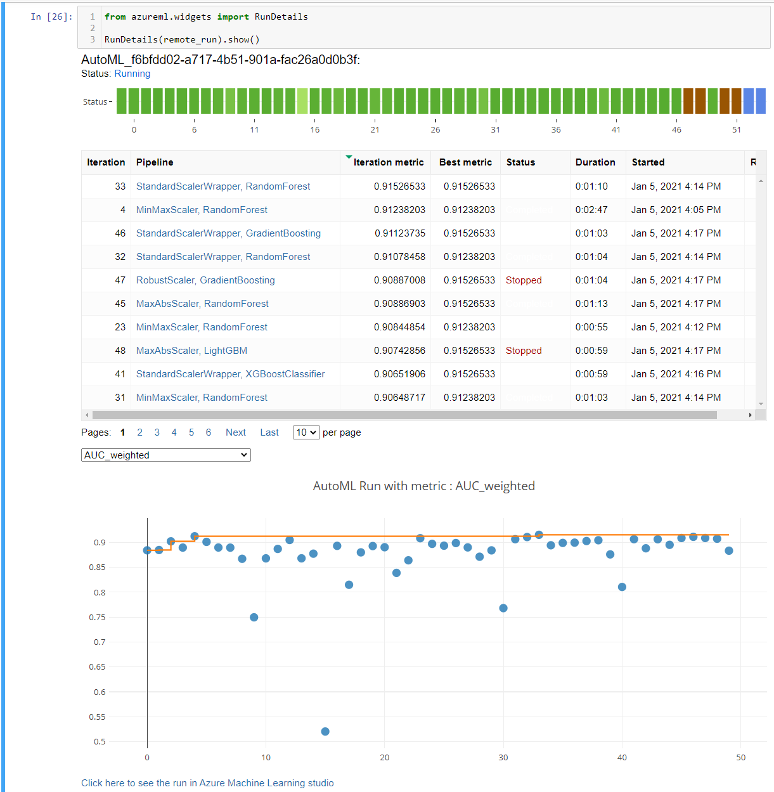
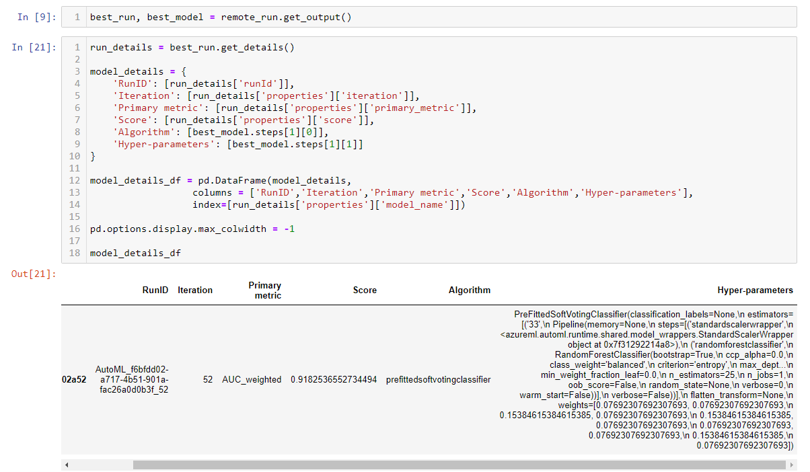
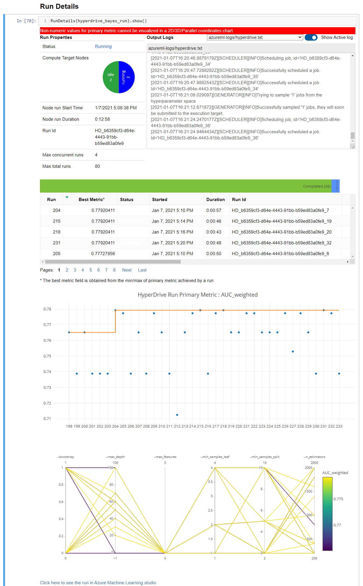
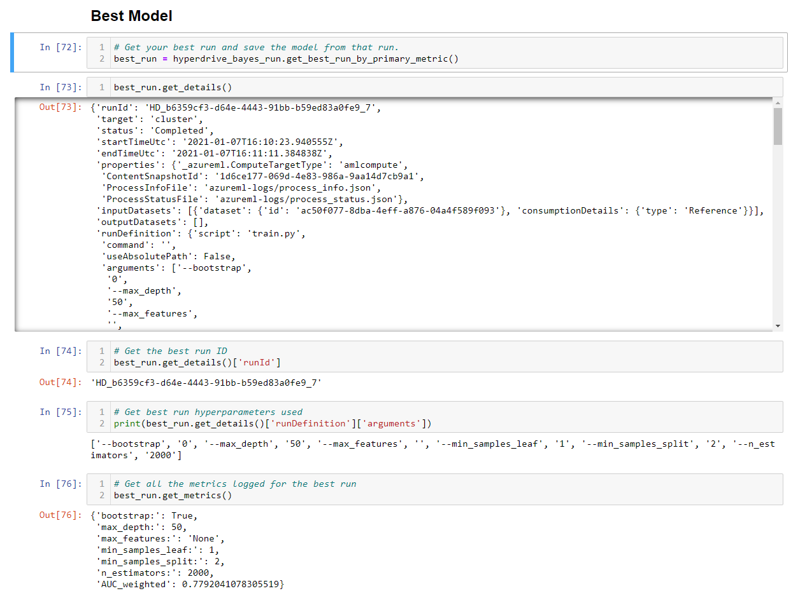
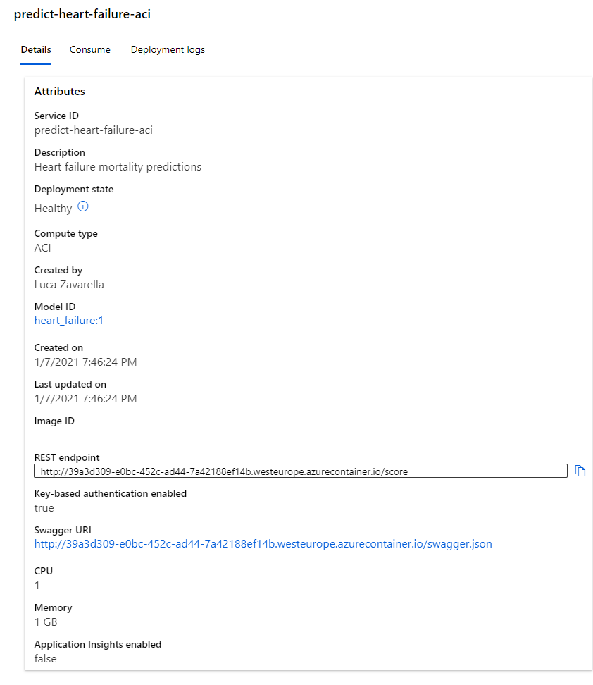

# Heart Failure Prediction using AutoML and HyperDrive

In this project two models, based on the heart failure clinical Kaggle dataset, are created: one using AutoML and one customized model whose hyperparameters are tuned using HyperDrive. The performance of both the models are compared and then the best performing model is deployed on ACI.

## Project Set Up and Installation

## Dataset

### Overview
Heart failure is a common event caused by cardiovascular diseases. People having cardiovascular disease or who are at high cardiovascular risk due to the presence of one or more risk factors such as hypertension, diabetes, hyperlipidemia, or already established diseases, need early diagnosis.

### Task
A machine learning model could predict if a patient is at risk and it could be of great help to medical personnel in trying to save those patients in serious condition.

The dataset that will be used for the training of the model is about 299 patients with heart failure collected in 2015. It contains 12 features that can be used to predict heart failure mortality:

1. age
2. anemia (Decrease of red blood cells or hemoglobin
3. creatinine_phosphokinase (Level of the CPK enzyme in the blood)
4. diabetes (If the patient has diabetes)
5. ejection_fraction (Percentage of blood leaving the heart at each contraction)
6. high_blood_pressure (If the patient has hypertension)
7. platelets (Platelets in the blood measured in kiloplatelets/mL)
8. serum_creatinine (Level of serum creatinine in the blood measured in mg/dL)
9. serum_sodium (Level of serum sodium in the blood measured in mEq/L)
10. sex (Woman or man)
11. smoking (If the patient smokes or not)
12. time (Follow-up period in days)
13. DEATH_EVENT (If the patient deceased during the follow-up period)

The target variable is DEATH_EVENT.

### Access
After registering the dataset in Azure ML Datasets, you can consume the data simply via a reference obtained with the Python SDK. In this case, it is possible to use the following code chunk:

```
from azureml.core import Workspace, Dataset

subscription_id = '<your-subscription-id>'
resource_group = '<your-resource-group-name>'
workspace_name = '<your-workspace-name>'

workspace = Workspace(subscription_id, resource_group, workspace_name)

dataset = Dataset.get_by_name(workspace, name='Heart Failure Prediction')
dataset.to_pandas_dataframe()
```

## Automated ML
The dataset is slightly imbalanced (the minority class is about 32%). This imbalance should be automatically handled by AutoML, but to be safe it is prudent to use *AUC_weighted* as the primary metric. The early stopping is enabled in order to avoid waste of money. A maximum of 5 concurrent iterations are allowed. Moreover, AutoML is authorized to automatically apply its featurization procedures to the dataset.

### Results
The AutoML best model (a soft voting ensemble) achieved an ***AUC_weighted*** of **0.9182**.

The estimators used by the ensemble are the following:

```
[('33',
  Pipeline(memory=None,
           steps=[('standardscalerwrapper',
                   <azureml.automl.runtime.shared.model_wrappers.StandardScalerWrapper object at 0x7f20089ebba8>),
                  ('randomforestclassifier',
                   RandomForestClassifier(bootstrap=True, ccp_alpha=0.0,
                                          class_weight='balanced',
                                          criterion='entropy', max_depth=None,
                                          max_features=0.3, max_leaf_nodes=None,
                                          max_samples=None,
                                          min_impurity_decrease=0.0,
                                          min_impurity_split=None,
                                          min_samples_leaf=0.01,
                                          min_samples_split=0.056842105263157895,
                                          min_weight_fraction_leaf=0.0,
                                          n_estimators=600, n_jobs=1,
                                          oob_score=False, random_state=None,
                                          verbose=0, warm_start=False))],
           verbose=False)),
 ('4',
  Pipeline(memory=None,
           steps=[('minmaxscaler', MinMaxScaler(copy=True, feature_range=(0, 1))),
                  ('randomforestclassifier',
                   RandomForestClassifier(bootstrap=True, ccp_alpha=0.0,
                                          class_weight='balanced',
                                          criterion='gini', max_depth=None,
                                          max_features='log2',
                                          max_leaf_nodes=None, max_samples=None,
                                          min_impurity_decrease=0.0,
                                          min_impurity_split=None,
                                          min_samples_leaf=0.01,
                                          min_samples_split=0.01,
                                          min_weight_fraction_leaf=0.0,
                                          n_estimators=25, n_jobs=1,
                                          oob_score=True, random_state=None,
                                          verbose=0, warm_start=False))],
           verbose=False)),
 ('46',
  Pipeline(memory=None,
           steps=[('standardscalerwrapper',
                   <azureml.automl.runtime.shared.model_wrappers.StandardScalerWrapper object at 0x7f1f740a5780>),
                  ('gradientboostingclassifier',
                   GradientBoostingClassifier(ccp_alpha=0.0, criterion='mse',
                                              init=None,
                                              learning_rate=0.021544346900318822,
                                              loss='deviance', max_depth=8,
                                              max_features=0.5,
                                              max_leaf_nodes=None,
                                              min_impurity_decrease=0.0,
                                              min_impurity_split=None,
                                              min_samples_leaf=0.01,
                                              min_samples_split=0.38473684210526315,
                                              min_weight_fraction_leaf=0.0,
                                              n_estimators=400,
                                              n_iter_no_change=None,
                                              presort='deprecated',
                                              random_state=None,
                                              subsample=0.43157894736842106,
                                              tol=0.0001, validation_fraction=0.1,
                                              verbose=0, warm_start=False))],
           verbose=False)),
 ('32',
  Pipeline(memory=None,
           steps=[('standardscalerwrapper',
                   <azureml.automl.runtime.shared.model_wrappers.StandardScalerWrapper object at 0x7f1f74014860>),
                  ('randomforestclassifier',
                   RandomForestClassifier(bootstrap=True, ccp_alpha=0.0,
                                          class_weight=None, criterion='gini',
                                          max_depth=None, max_features=0.4,
                                          max_leaf_nodes=None, max_samples=None,
                                          min_impurity_decrease=0.0,
                                          min_impurity_split=None,
                                          min_samples_leaf=0.01,
                                          min_samples_split=0.2442105263157895,
                                          min_weight_fraction_leaf=0.0,
                                          n_estimators=200, n_jobs=1,
                                          oob_score=True, random_state=None,
                                          verbose=0, warm_start=False))],
           verbose=False)),
 ('47',
  Pipeline(memory=None,
           steps=[('robustscaler',
                   RobustScaler(copy=True, quantile_range=[25, 75],
                                with_centering=True, with_scaling=True)),
                  ('gradientboostingclassifier',
                   GradientBoostingClassifier(ccp_alpha=0.0,
                                              criterion='friedman_mse', init=None,
                                              learning_rate=0.046415888336127774,
                                              loss='deviance', max_depth=1,
                                              max_features=0.5,
                                              max_leaf_nodes=None,
                                              min_impurity_decrease=0.0,
                                              min_impurity_split=None,
                                              min_samples_leaf=0.1131578947368421,
                                              min_samples_split=0.2442105263157895,
                                              min_weight_fraction_leaf=0.0,
                                              n_estimators=400,
                                              n_iter_no_change=None,
                                              presort='deprecated',
                                              random_state=None,
                                              subsample=0.8578947368421053,
                                              tol=0.0001, validation_fraction=0.1,
                                              verbose=0, warm_start=False))],
           verbose=False)),
 ('48',
  Pipeline(memory=None,
           steps=[('maxabsscaler', MaxAbsScaler(copy=True)),
                  ('lightgbmclassifier',
                   LightGBMClassifier(boosting_type='goss', class_weight=None,
                                      colsample_bytree=0.5944444444444444,
                                      importance_type='split',
                                      learning_rate=0.07368684210526316,
                                      max_bin=260, max_depth=-1,
                                      min_child_samples=15, min_child_weight=3,
                                      min_split_gain=1, n_estimators=200,
                                      n_jobs=1, num_leaves=68, objective=None,
                                      random_state=None,
                                      reg_alpha=0.47368421052631576,
                                      reg_lambda=0.5263157894736842, silent=True,
                                      subsample=1, subsample_for_bin=200000,
                                      subsample_freq=0, verbose=-10))],
           verbose=False)),
 ('17',
  Pipeline(memory=None,
           steps=[('minmaxscaler', MinMaxScaler(copy=True, feature_range=(0, 1))),
                  ('extratreesclassifier',
                   ExtraTreesClassifier(bootstrap=True, ccp_alpha=0.0,
                                        class_weight='balanced', criterion='gini',
                                        max_depth=None, max_features=0.1,
                                        max_leaf_nodes=None, max_samples=None,
                                        min_impurity_decrease=0.0,
                                        min_impurity_split=None,
                                        min_samples_leaf=0.01,
                                        min_samples_split=0.15052631578947367,
                                        min_weight_fraction_leaf=0.0,
                                        n_estimators=50, n_jobs=1,
                                        oob_score=False, random_state=None,
                                        verbose=0, warm_start=False))],
           verbose=False)),
 ('16',
  Pipeline(memory=None,
           steps=[('minmaxscaler', MinMaxScaler(copy=True, feature_range=(0, 1))),
                  ('randomforestclassifier',
                   RandomForestClassifier(bootstrap=True, ccp_alpha=0.0,
                                          class_weight=None, criterion='gini',
                                          max_depth=None, max_features=0.05,
                                          max_leaf_nodes=None, max_samples=None,
                                          min_impurity_decrease=0.0,
                                          min_impurity_split=None,
                                          min_samples_leaf=0.01,
                                          min_samples_split=0.10368421052631578,
                                          min_weight_fraction_leaf=0.0,
                                          n_estimators=25, n_jobs=1,
                                          oob_score=False, random_state=None,
                                          verbose=0, warm_start=False))],
           verbose=False)),
 ('42',
  Pipeline(memory=None,
           steps=[('maxabsscaler', MaxAbsScaler(copy=True)),
                  ('gradientboostingclassifier',
                   GradientBoostingClassifier(ccp_alpha=0.0, criterion='mse',
                                              init=None, learning_rate=0.1,
                                              loss='deviance', max_depth=8,
                                              max_features=0.6,
                                              max_leaf_nodes=None,
                                              min_impurity_decrease=0.0,
                                              min_impurity_split=None,
                                              min_samples_leaf=0.035789473684210524,
                                              min_samples_split=0.38473684210526315,
                                              min_weight_fraction_leaf=0.0,
                                              n_estimators=600,
                                              n_iter_no_change=None,
                                              presort='deprecated',
                                              random_state=None, subsample=1,
                                              tol=0.0001, validation_fraction=0.1,
                                              verbose=0, warm_start=False))],
           verbose=False)),
 ('11',
  Pipeline(memory=None,
           steps=[('robustscaler',
                   RobustScaler(copy=True, quantile_range=[10, 90],
                                with_centering=True, with_scaling=False)),
                  ('extratreesclassifier',
                   ExtraTreesClassifier(bootstrap=True, ccp_alpha=0.0,
                                        class_weight=None, criterion='entropy',
                                        max_depth=None, max_features=0.5,
                                        max_leaf_nodes=None, max_samples=None,
                                        min_impurity_decrease=0.0,
                                        min_impurity_split=None,
                                        min_samples_leaf=0.01,
                                        min_samples_split=0.15052631578947367,
                                        min_weight_fraction_leaf=0.0,
                                        n_estimators=25, n_jobs=1,
                                        oob_score=False, random_state=None,
                                        verbose=0, warm_start=False))],
           verbose=False))]
```

Each estimator is weighted as follows respectively:

```
[0.07692307692307693,
 0.07692307692307693,
 0.15384615384615385,
 0.07692307692307693,
 0.15384615384615385,
 0.07692307692307693,
 0.07692307692307693,
 0.07692307692307693,
 0.15384615384615385,
 0.07692307692307693]
```

Maybe a thorough analysis of the dataset data, along with a thorough understanding of medical details represented by the features, made before run the AutoML experiment could have brought new insights, which could have been distilled into new features. But the actual model performance is very good.

The following one is the screenshot of the `RunDetails` widget:



The following one is the screenshot of the best model trained by AutoML with it's parameters:




<!-- #region -->
## Hyperparameter Tuning

As I saw from the previous experiment that Random Forest is one of the best base performing algorithms used into the ensemble, I chose the *RandomForestClassifier* as the base algorithm to be tuned with HyperDrive.

The hyper-parameters I chose to vary and their ranges are the following ones:

* *bootstrap*: (1, 0)
    + Whether bootstrap samples are used when building trees. If False, the whole dataset is used to build each tree
* *max_depth*: (None, 10, 20, 30, 40, 50, 60, 70, 80, 90, 100)
    + The maximum depth of the tree. If None, then nodes are expanded until all leaves are pure or until all leaves contain less than min_samples_split samples
* *max_features*: (None, 'sqrt')
    + The number of features to consider when looking for the best split
* *min_samples_leaf*: (1, 2, 4)
    + The minimum number of samples required to be at a leaf node
* *min_samples_split*: (2, 5, 10)
    + The minimum number of samples required to split an internal node
* *n_estimators*: (200, 400, 600, 800, 1000, 1200, 1400, 1600, 1800, 2000)
    + The number of trees in the forest
    
In order to find the best combination of hyper-parameters in the whole parameter space, I used the Bayesian sampling strategy, which somehow takes into account the results obtained from the training done using other combinations of hyper-parameters.

The primary metric I chose is the *AUC Weighted* (that is a *roc_auc_score* having the parameter *average* set to "weighted"). First of all, it accounts for imbalanced datasets. Then, it is the same metric used for the AutoML experiment. In this way I can compare the models the two experiment give as output.
    
### Results

The *RandomForestClassifier* with *HyperDrive* achieved an ***AUC_weighted*** of **0.7792**. The hyper-parameters used by this model are:

* bootstrap: False
* max_depth: 50
* max_features: None
* min_samples_leaf: 1
* min_samples_split: 2
* n_estimators: 2000

Just as in the previous experiment, better performance could be achieved by doing a detailed analysis of the data before training and adding new features that could help the training phase to achive better performance.


The following one is the screenshot of the `RunDetails` widget:



The following one is the screenshot of the best model trained by AutoML with it's parameters:




## Model Deployment

Of the two models, the one that **performs best** is the ensemble generated by **AutoML**. The difference of performance is given surely from the aid that the features generated from the automatic featurization have given in the phase of training.

The soft voting ensemble model has beed deployed on Azure Container Instances with success and it is in healty state:



As the best performer was an AutoML trained model, it was necessary to use the files *conda_env_1_0_0.yml* and *scoring_file_v_1_0_0.py* generated in the output folder of the best model to create the endpoint.

Here the schema for the input data I got from Swagger to use as input for the endpoint:

```
{
	"age": {
		"type": "number",
		"format": "double"
	},
	"anaemia": {
		"type": "number",
		"format": "double"
	},
	"creatinine_phosphokinase": {
		"type": "number",
		"format": "double"
	},
	"diabetes": {
		"type": "number",
		"format": "double"
	},
	"ejection_fraction": {
		"type": "number",
		"format": "double"
	},
	"high_blood_pressure": {
		"type": "number",
		"format": "double"
	},
	"platelets": {
		"type": "number",
		"format": "double"
	},
	"serum_creatinine": {
		"type": "number",
		"format": "double"
	},
	"serum_sodium": {
		"type": "number",
		"format": "double"
	},
	"sex": {
		"type": "number",
		"format": "double"
	},
	"smoking": {
		"type": "number",
		"format": "double"
	},
	"time": {
		"type": "number",
		"format": "double"
	}
}
```

## Screen Recording

Here [the link](https://youtu.be/BHd1330YGLM) to the video showing a short demo of the deployed model.

## Standout Suggestions

I tried to convert the best model into the ONNX format using *WinMLTools*. As currently the Azure ML Python SDK is at 1.19.0 version, it seems right now WinMLTools is incompatible with this version:

```
...
ERROR: azureml-automl-runtime 1.17.0 has requirement azureml-automl-core~=1.17.0, but you'll have azureml-automl-core 1.19.0 which is incompatible.
...
```

Despite this, I still tried to do a conversion, but got the following error:

```
RuntimeError: Unable to find a shape calculator for type '<class 'azureml.automl.runtime.featurization.data_transformer.DataTransformer'>'.
```

Therefore, I suspect that a model trained with AutoML is not convertible using this tool.

<!-- #endregion -->

```python

```
